# eAgriWallet App - AgriTech App.

  
 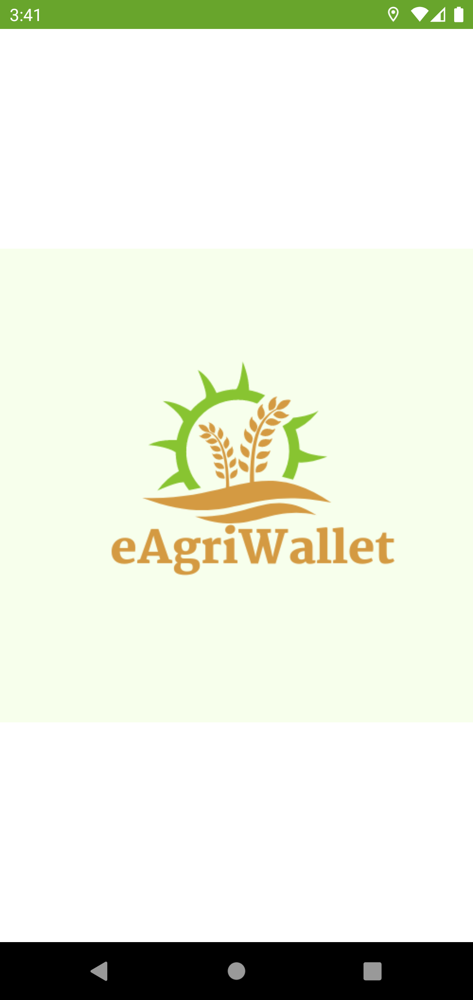
 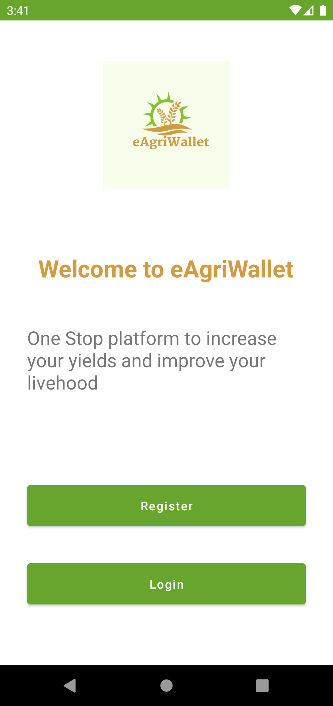
 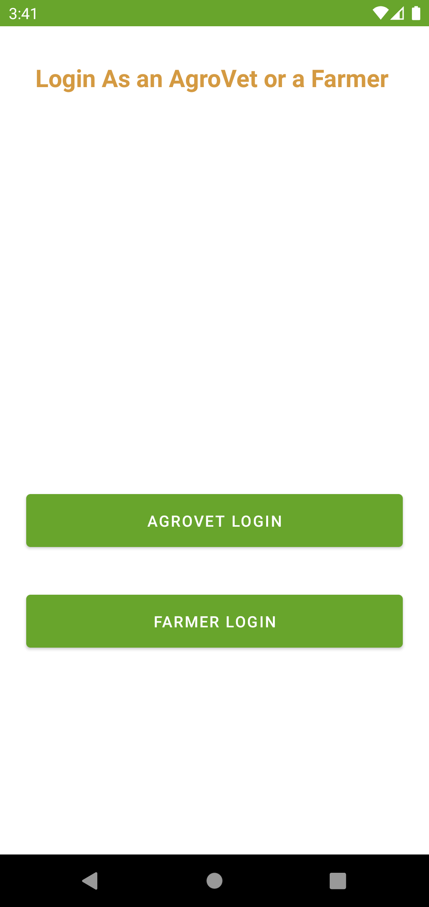
 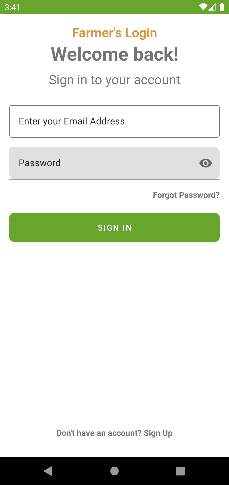
 
 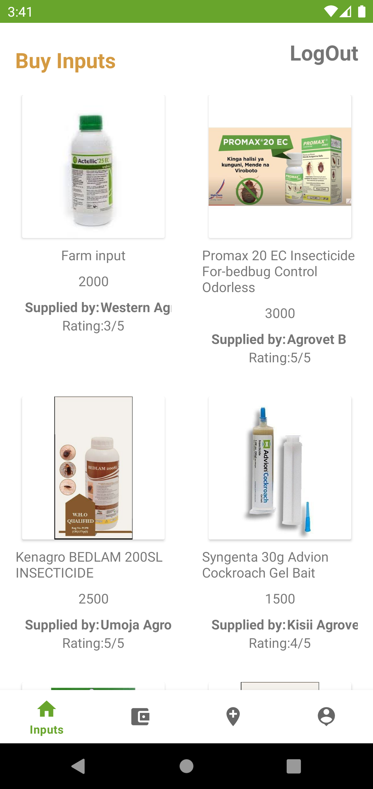
   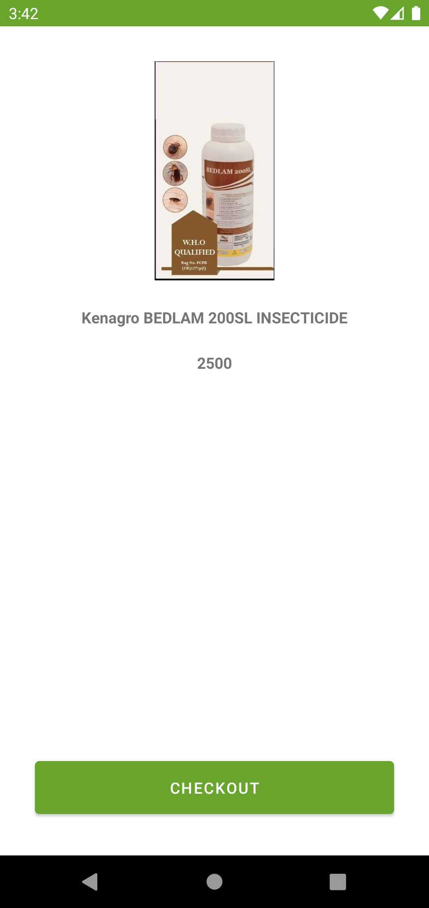
  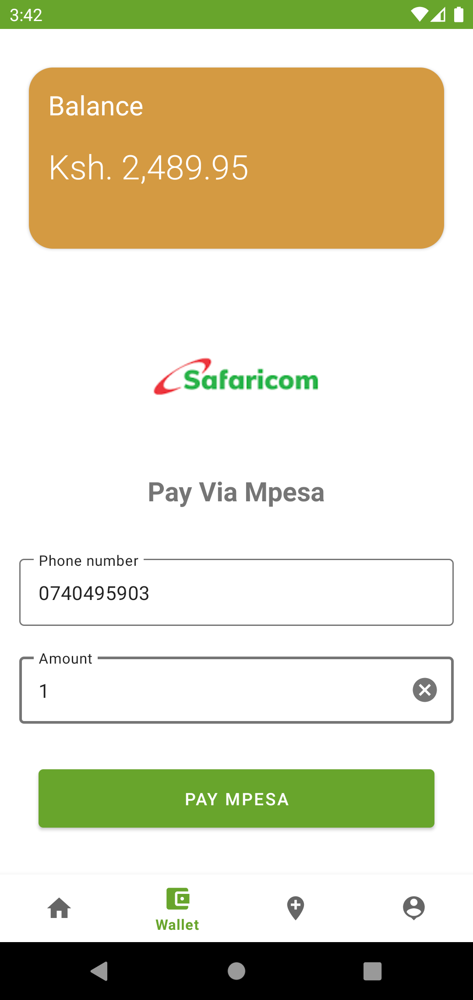
    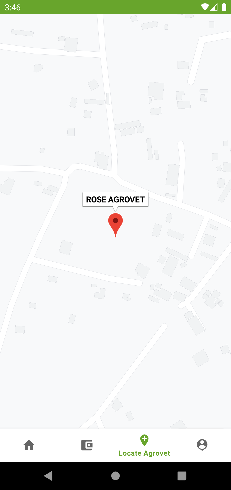
  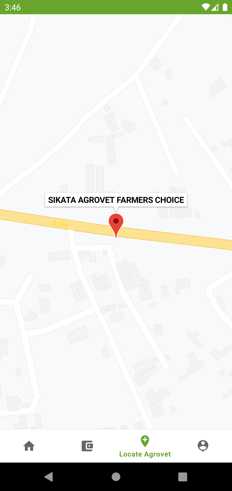

  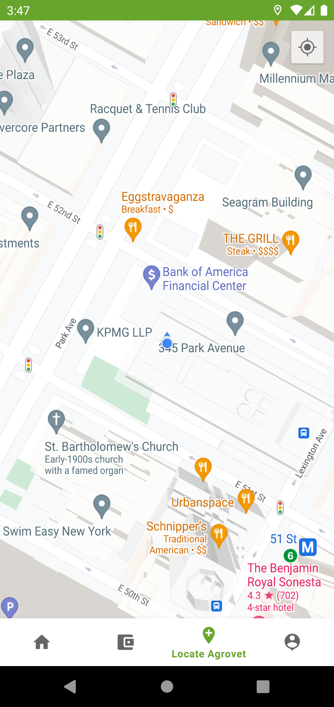

 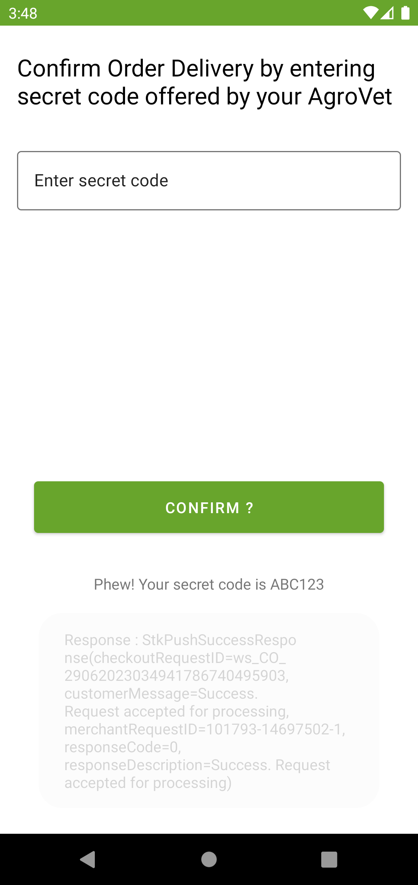
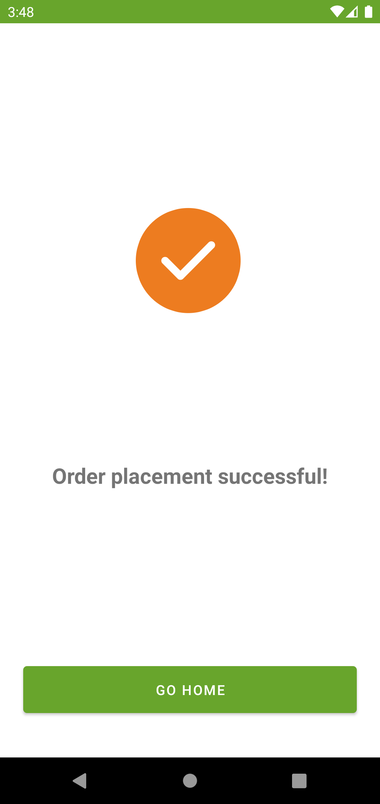

  
  

   

## Important Features
[x] - Google Maps SDK integration
[X] - MPESA Daraja SDK (Payment Integration)
[X] - Authentication
[X] - Fetching Remote Data 

## Run The APP
- https://appetize.io/app/kcu736b7ggjilqqn5jz3rh6vge?device=pixel4&osVersion=11.0&scale=50
